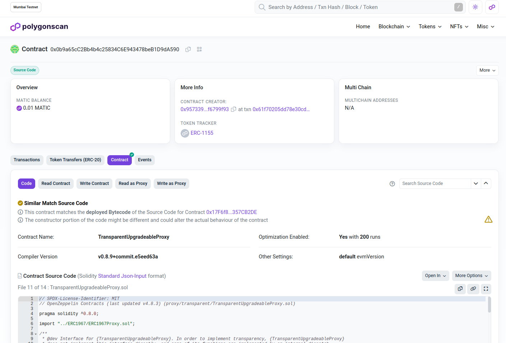
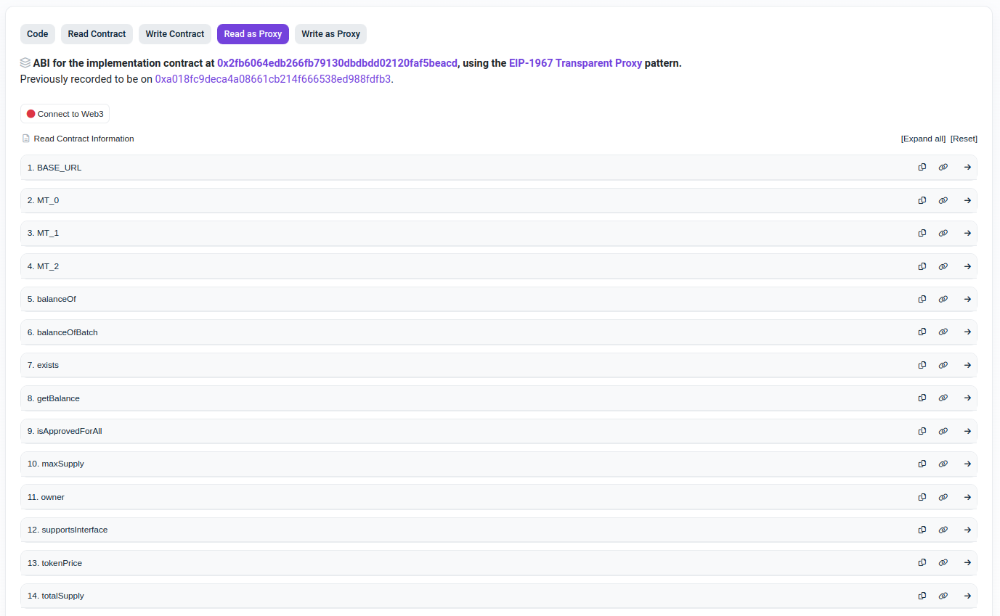
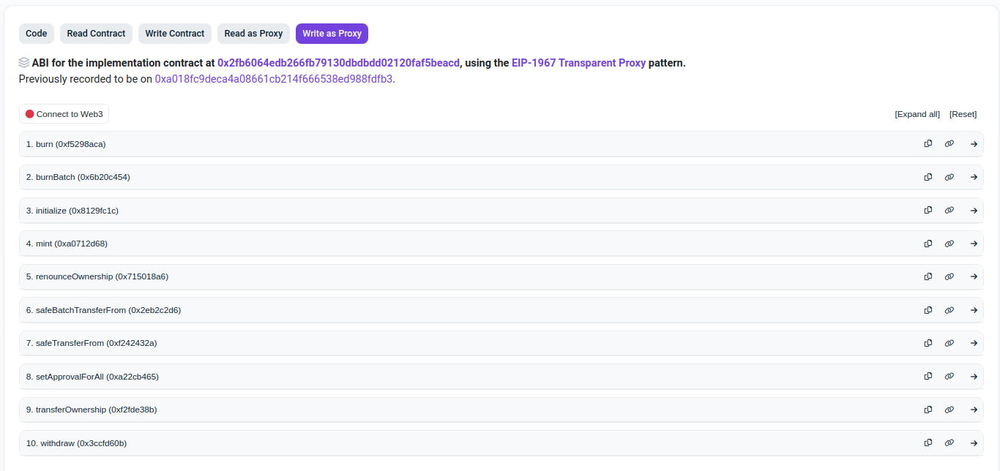

# OPENZEPPELIN UPGRADEABLE PROXY ERC-1967

A professional solidity Upgradeable Proxy [ERC-1967 Standard](https://eips.ethereum.org/EIPS/eip-1967) contract example based on OpenZeppelin library.

## :speech_balloon: Description

<p align="justify">An upgradeable smart contract uses a special feature called a "proxy pattern" that gives developers some leeway to modify contract logic post-deployment.</p>
<p align="justify">Proxy Storage Slots are a consistent location where proxies store the address of the logic contract they delegate to, as well as other proxy-specific information.</p>
<p align="justify">Delegating proxy contracts are widely used for both upgradeability and gas savings. These proxies rely on a logic contract (also known as implementation contract or master copy) that is called using delegatecall. This allows proxies to keep a persistent state (storage and balance) while the code is delegated to the logic contract.</p>
<p align="justify">This project is a simple implementation of ERC-1155 Multi Token using the OpenZeppElin ERC-1967 standard, with the most important functionalities for an Upgradeable Proxy Smart Contract, to help you save time in coding and have the most secure code as possible.</p>

<table>
    <tr>
        <td colspan='2'>
            <kbd>
                
            </kbd>
        </td>
    </tr>
    <tr>
        <td>
            
        </td>
        <td>
            
        </td>
    </tr>
<table>

### 🛠️ Features

The OpenZeppelin ERC-1967 Upgradeable Proxy contract offers these main features:

- **Cost Reduction**: The ERC-1967 standard is a sophisticated proxy model that optimizes deployment costs and gas usage by recording the deployment address in a single storage slot within the proxy contract.
- **Upgradeable**: The proxy pattern allows writing a contract that is upgradable post-deployment, as information is stored in the main contract, not in the implementation contract.

### 🏗️ Built With

The core of this project was built using all these great tools:

- [Solidity](https://soliditylang.org/) - Ethereum Programming Language
- [TypeScript](https://www.typescriptlang.org/) - Typed Programming Language
- [Hardhat](https://hardhat.org/) - Development Environment for Ethereum Software
- [Ethers.js](https://ethers.org/) - Web3 Library
- [OpenZeppelin](https://www.openzeppelin.com/) - Web3 Solidity Contract Libraries
- [Node.js](https://nodejs.org/) - JavaScript Runtime Environment

In addition, in order to function fully and satisfactorily, this project uses resources from the following services:

- [Pinata](https://app.pinata.cloud/) - IPFS File Sharing
- [Polygon Scan](https://polygonscan.com/) - Polygon Block Explorer

## Getting Started

### 📋 Prerequisites

- Node.js
- CLI/Terminal
- IDE or Text Editor
- Wallet address in an EVM compatible chain
- Balance to deploy the Smart Contract

### :gear: Configuration

Clone the `.env.example` file into a new `.env` file.
After this, adjust the `SECRET` with your seed phrase, `API_KEY` with your API Key (get it in a production block explorer), `RPC_URL` with the RPC url of your chain  and `CHAIN_ID` with the Chain ID of the chain.

```bash
# MetaMask mnemonic 12-word phrase
SECRET=

# Blockchain API Key (get in EtherScan, BSC Scan, SnowTrace, Polygon,...)
API_KEY=

# RPC Server URL (e.g. "https://polygon-mumbai-bor.publicnode.com")
RPC_URL=

# RPC Chain ID (e.g 80001)
CHAIN_ID=
```

Change the `maxSupply` for the three token types maximum supply and the `tokenPrice` for your desired initial value.

```solidity
    function initialize() initializer public {
        __ERC1155_init(BASE_URL);
        __ERC1155Burnable_init();
        __Ownable_init();
        __ERC1155Supply_init();
        // Change the tokenPrice and maxSupply as desired
        tokenPrice = 0.01 ether;
        maxSupply = 50;
    } 
```

After create the [Metadata URI JSON Schema](https://eips.ethereum.org/EIPS/eip-721#specification), adjust the `BASE_URL` address for your own address.

```solidity
    string public constant BASE_URL = "ipfs://mybaseurladdress/";
```

### 👨‍💻 Testing

To test your OpenZeppelin ERC-1155 smart contract run this command:

```bash
$ npm test
```

To test and view the tests coverage of your OpenZeppelin ERC-1155 smart contract run this command:

```bash
$ npm run cov
```

### 👷 Deploy

To deploy your OpenZeppelin ERC-1967 smart contract run this command:

```bash
$ npm run deploy
```

After deploy, put the deployed contract address inside the `upgradeProxy()` function, in the `scripts/update.ts` file:

```solidity
    const cc = await upgrades.upgradeProxy("DEPLOYED_CONTRACT_ADDRESS_HERE", OZMultiToken);
```

To update your OpenZeppelin ERC-1967 smart contract, after change the implementation, using Transparent Proxy schema run this command:

```bash
$ npm run update
```

With the deployed contract address in the hands, run this command to verify it:

```bash
$ npm run verify <contract_address>
```

If you have placed the deployed contract address in the `upgradeProxy()` function, simple run this command to verify all contracts after updating:

```bash
$ npm run verify
```

### :arrow_forward: Usage

You can interact with your deployed contract in two ways:

1. **By your chain's block explorer**

- **Get the Contract Address**: First, you need to know the address of the deployed smart contract.
- **Open the Block Explorer**: Choose a blockchain block explorer that supports the network where your contract is deployed. Examples of popular block explorers are [Etherscan](https://etherscan.io/) for Ethereum, [BscScan](https://bscscan.com/) for BNB Smart Chain, [SnowTrace](https://snowtrace.io/) for Avalanche C-Chain and [PolygonScan](https://polygonscan.com/) for Polygon PoS Chain.
- **Search for the Contract Address**: In the search bar of the block explorer, enter the contract address and click "Search". The block explorer will display the contract's details, including its code, transactions, and events.
- **Functions**: Look for a "Read Contract" or "Write Contract" section.
  - **Read Functions**: For read-only functions (functions that don't modify the state), you can call them directly from the block explorer's interface, and it will display the returned value.
  - **Write Functions**: To interact with write functions (functions that modify the state), you will need to provide the necessary parameters and possibly your wallet's signature for authentication. After filling in the required details, submit the transaction.
    - **IMPORTANT**: To interact correctly with the functions you must use the `Read as Proxy` and `Write as Proxy` interfaces.
- **Transaction Monitoring**: Block explorers also provide real-time transaction monitoring. After initiating a contract function execution, the explorer will display the transaction details, including the transaction hash, status, and gas fees.

_It's essential to be cautious when executing write functions, as blockchain transactions are irreversible. Always double-check the inputs._

2. **By a Frontend DApp**

Use the [Mabesi OZ Multi Token Dapp](https://github.com/mabesi/dapp-multitoken) as your frontend interface user. This DApp was made with React/Next.js to be integrant part of this Multi Token smart contract.

### 🔧 Troubleshooting

Contracts published on the blockchain are immutable. Thus, if it is necessary to correct any errors or make any changes, you must deploy again, generating a new contract address and reinitializing all state variable information.

It is possible to perform data migration in case of a new deployment of the contract, but for this you must make a plan, performing the backup beforehand and creating a migration script.

## Back Matter

### :clap: Acknowledgements

Thanks to all these amazing people and tools that served as a source of knowledge or were an integral part in the construction of this project.

- [LuizTools](https://www.luiztools.com.br/) - JavaScript and Web3 Online Courses

### 🔎 See Also

Enjoy these similar projects that can help you as a way of learning or as a basis for creating a larger project.

- [Basic Token ERC-20](https://github.com/mabesi/solidity-coin-erc20)
- [Basic Token BEP-20](https://github.com/mabesi/solidity-coin-bep20)
- [Basic NFT ERC-721](https://github.com/mabesi/solidity-nft-erc721)
- [Basic Azuki NFT ERC-721A](https://github.com/mabesi/azuki-nft)
- [Mabesi Azuki NFT DApp](https://github.com/mabesi/dapp-nft)
- [Basic Multi Token ERC-1155](https://github.com/mabesi/solidity-multitoken-erc1155)
- [OpenZepppelin Multi Token ERC-1155](https://github.com/mabesi/openzeppelin-multitoken-erc1155)

### ✒️ Authors & Contributors

| [<br><sub>Plinio Mabesi</sub>](https://github.com/mabesi) |
| :---: |


### 👮🏼‍♂️ Legal Disclaimer

<p align="justify">This tool was created for educational purposes and has the sole purpose of serving as an example of the implementation of a Smart Contract following the proposed standards, in accordance with what is contained in the references.</p>
<p align="justify">The use of this tool, for any purpose, will occur at your own risk, being your sole responsibility for any legal implications arising from it.</p>
<p align="justify">It is also the end user's responsibility to know and obey all applicable local, state and federal laws. Developers take no responsibility and are not liable for any misuse or damage caused by this program.</p>

### 📜 License

This project is licensed under the [MIT License](LICENSE.md).